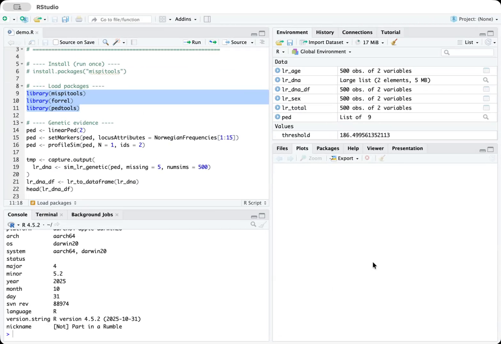
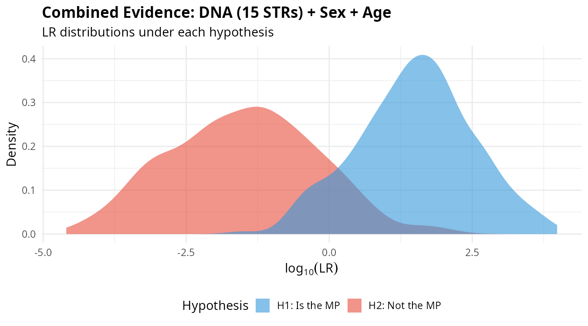
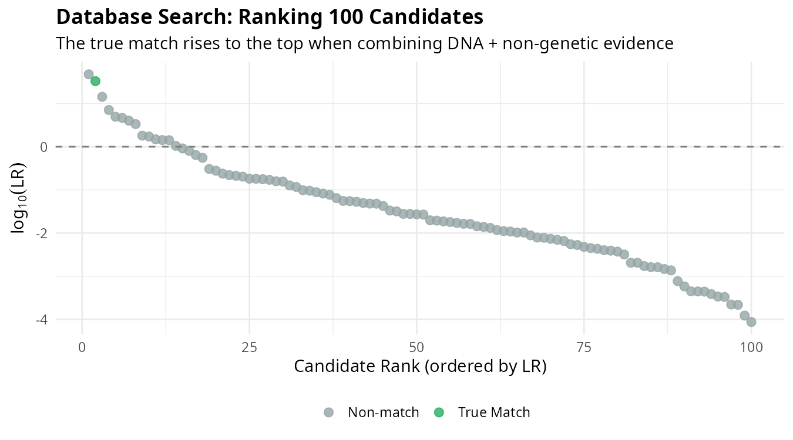
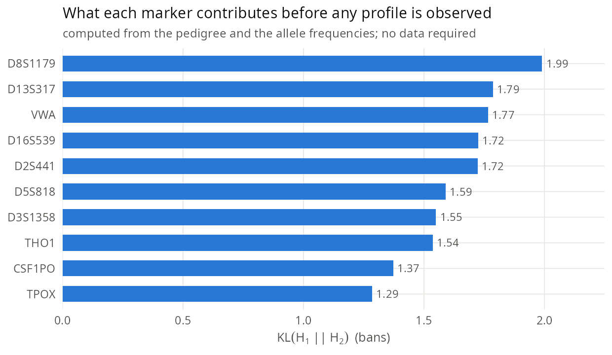
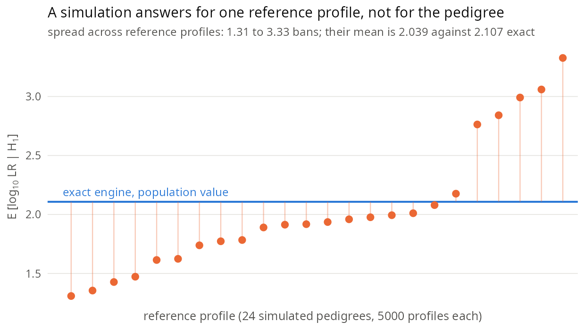
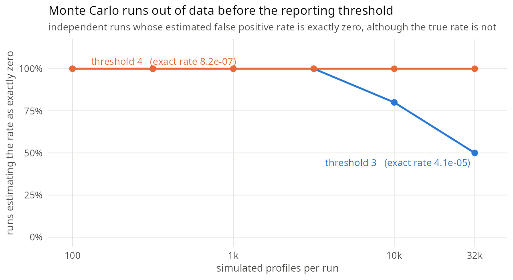
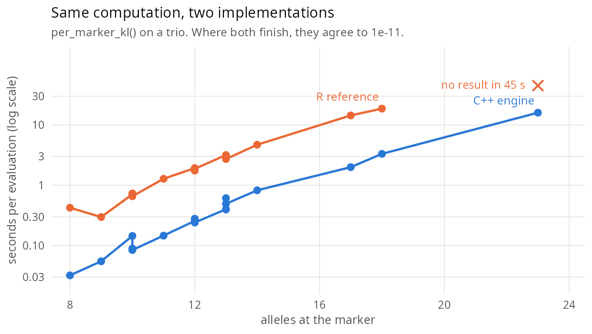

# mispitools: Likelihood Ratios in Forensic Sciences

<!-- badges: start -->
[](https://CRAN.R-project.org/package=mispitools)
[](https://cran.r-project.org/package=mispitools)
[](https://cran.r-project.org/package=mispitools)
<!-- badges: end -->

<br clear="left"/>

## The Problem

When unidentified human remains are found, forensic scientists must search databases of missing persons to find potential identifications. **mispitools** provides a statistical framework based on likelihood ratios (LRs) to quantify the weight of evidence, combining genetic and non-genetic information, and support decision-making in these investigations.

## Video Tutorial

<p align="center">
<a href="https://github.com/user-attachments/assets/29a43d60-5d82-4465-be30-c42f3f062ca3">

</a>
</p>

*Tutorial by [Suisei Nakagawa](https://github.com/SuiseiNakagawa)*

## Why Likelihood Ratios?

The likelihood ratio is the gold standard for evidence evaluation in forensic science. Rather than providing a binary "yes/no" answer, the LR tells us how much the evidence should change our belief about an identification.

We evaluate evidence under two competing hypotheses:

- **H1**: The person of interest (POI) **is** the missing person (MP)
- **H2**: The POI is **not** the MP (is an unrelated individual from the population)

$$LR = \frac{P(\text{Evidence} \mid H_1)}{P(\text{Evidence} \mid H_2)}$$

- **LR > 1**: Evidence is more probable if the POI is the MP
- **LR < 1**: Evidence is more probable if the POI is not the MP
- **LR = 1**: Evidence is uninformative

The LR is **not** a probability of identification. It measures the relative support provided by the evidence, which can then be combined with prior information to make decisions.

## Installation

```r
# From CRAN
install.packages("mispitools")

# Development version
devtools::install_github("MarsicoFL/mispitools")
```

## Tutorial: A Complete Workflow

Consider a realistic scenario: a family reports a person missing, and investigators need to search a database of unidentified individuals. The family provides a DNA sample from a relative (e.g., a grandparent), and investigators have information about the missing person's physical characteristics.

### Step 1: Genetic Evidence

We simulate LR distributions from DNA evidence. This requires defining a pedigree structure connecting the MP to the reference individual who provided a DNA sample.

```r
library(mispitools)
library(forrel)
library(pedtools)

# Define pedigree: grandparent-grandchild relationship
ped <- linearPed(2)  # 3-generation pedigree
ped <- setMarkers(ped, locusAttributes = NorwegianFrequencies[1:15])
ped <- profileSim(ped, N = 1, ids = 2)  # Simulate reference profile

# Simulate LRs under both hypotheses
lr_dna <- sim_lr_genetic(ped, missing = 5, numsims = 500)
lr_dna_df <- lr_to_dataframe(lr_dna)

head(lr_dna_df)
#>      Related  Unrelated
#> 1  1247.3201  0.0023415
#> 2   892.1547  0.0001823
#> ...
```

The `Related` column contains LRs simulated under H1 (when the POI truly is the MP), while `Unrelated` contains LRs under H2 (when the POI is unrelated).

### Step 2: Non-Genetic Evidence

Physical characteristics such as biological sex, estimated age, and anthropological features also provide evidential value:

```r
# Simulate LR distributions for sex and age
lr_sex <- sim_lr_prelim("sex", numsims = 500)
lr_age <- sim_lr_prelim("age", numsims = 500)

head(lr_sex)
#>    Related Unrelated
#> 1    1.863    0.1052
#> 2    1.863    1.8627
#> ...
```

### Step 3: Combining Evidence

When evidence sources are conditionally independent, their LRs multiply. This is a fundamental property of the Bayesian framework:

```r
# Combine DNA + sex + age
lr_total <- lr_combine(lr_dna_df, lr_sex)
lr_total <- lr_combine(lr_total, lr_age)

# Visualize the combined LR distribution
plot_lr_distribution(lr_total)
```

<p align="center">

</p>

The separation between distributions under H1 (blue) and H2 (red) reflects the discriminating power of the combined evidence. Greater separation means better ability to distinguish between the two hypotheses.

### Step 4: Database Search

In practice, we search databases containing unidentified individuals. Each candidate receives an LR based on all available evidence, and candidates are ranked accordingly:

<p align="center">

</p>

The individual corresponding to the actual MP (blue) rises to the top of the ranking. This demonstrates how combining multiple evidence sources improves our ability to identify the correct individual among many candidates.

### Step 5: Decision Analysis

To convert LRs into decisions, we analyze error rates at different thresholds:

```r
# Find optimal threshold balancing false positives and false negatives
threshold <- decision_threshold(lr_total, weight = 10)

# Examine error rates at this threshold
threshold_rates(lr_total, threshold)
```

The `weight` parameter reflects the relative cost of false positives versus false negatives. In forensic contexts, falsely identifying someone (false positive) is typically considered more serious than failing to identify (false negative).

### Step 6: Fragility Diagnostics

Two cases with the same combined LR can have very different inferential stability. One may distribute the support evenly across markers; another may owe most of its weight to a single marker — and would collapse if that marker were challenged. **mispitools** quantifies this with the inclusion concentration index $C_W^+$ and the leave-one-out diagnostic, and provides a per-case reportable statement:

```r
# Per-marker LRs from forrel::missingPersonLR() or sim_lr_genetic()
lrs_per_marker <- c(D3S1358 = 5.2, TH01 = 12.0, D21S11 = 3.1, FGA = 8.4)

# Calibrate the pedigree-specific cutoff under H_p
cal <- calibrate_concentration_cutoff(
  reference = ped, missing = 5,
  numsims = 1500, probs = 0.90
)

# Per-case fragility report against the calibrated cutoff
fr <- fragility_report(
  per_marker_lrs = lrs_per_marker,
  cutoff = cal$cutoff, probs = cal$probs
)
fr$flag        # TRUE if leave-one-out review is required
fr$statement   # natural-language sentence for the case file
```

The framework — axiomatic characterization of $C_W^+$, the leave-one-out identity, and complementarity with population-level mis-specification bounds — is developed in Marsico & Egeland (in preparation).

### Step 7: Sequential Evidence and Belief Trajectories

The combined LR is a single number, but the evidence arrives in pieces. The
trajectory of the posterior as each piece is added carries information the
endpoint does not: whether belief moved steadily or turned on one step, and
whether an intermediate state contradicted the final one.

```r
# Prior over the two hypotheses, then one LR vector per evidence step
tr <- belief_trajectory(
  prior    = c(0.05, 0.95),
  lr_list  = list(c(5.2, 1), c(12.0, 1), c(3.1, 1), c(8.4, 1))
)
round(tr, 5)
#>         [,1]    [,2]
#> [1,] 0.05000 0.95000
#> [2,] 0.21488 0.78512
#> [3,] 0.76658 0.23342
#> [4,] 0.91056 0.08944
#> [5,] 0.98844 0.01156

trajectory_metrics(tr)
#> $kl_from_prior
#> [1] 0.00000000 0.07106659 0.76656675 1.05583811 1.25887080
#>
#> $path_length
#> [1] 0.9384421
#>
#> $concentration
#> [1] 0.7031878
```

Row 1 is the prior and each subsequent row is the posterior after one more
piece of evidence. `trajectory_metrics()` summarises the path: `kl_from_prior`
is how far belief has travelled from the prior at each step, `path_length` the
total distance covered, and `concentration` how much of that movement is owed
to a single step. Here the second step alone accounts for most of the update.

`binary_belief_trajectory()` is the two-hypothesis shortcut that takes
per-marker LRs directly and returns the cumulative `log10` LR alongside the
posterior. `familias_trajectory()` extracts the same metrics from a
`Familias::FamiliasPosterior` result, so a case already worked up in Familias
can be examined without recomputing it.

### Step 8: Sensitivity to the Assumed Error Rates

The non-genetic LRs depend on error rates that are assigned, not measured. A
reported LR is only as defensible as the range of assumptions that leaves it
unchanged, so the dependence can be traced explicitly:

```r
lr_sensitivity(evidence_type = "sex", param = "eps",
               range = c(0.01, 0.2), steps = 5)
#>   param_value    LR  log10_LR
#> 1      0.0100 1.980 0.2966652
#> 2      0.0575 1.885 0.2753114
#> 3      0.1050 1.790 0.2528530
#> 4      0.1525 1.695 0.2291697
#> 5      0.2000 1.600 0.2041200
```

A twentyfold change in the assumed error rate moves the LR from 1.98 to 1.60.
The evidence is weak either way, and the conclusion does not hinge on the
choice — which is the statement worth making in a report.


## Extension in 2.0: Exact Evaluation

Steps 1 to 6 estimate the LR distributions by simulation: `sim_lr_genetic()`
draws profiles and the distribution emerges from the sample. Version 2.0 adds
a second route to the same quantities. Given the pedigree and the allele
frequencies, the distribution of the LR is determined, so it can be computed
rather than sampled. There is no simulation error to report and no `numsims`
to choose; the cost moves elsewhere, to the size of the pedigree, as described
at the end of this section.

The engine is written in C++ and is reached through four entry points. The
section below runs all four on the case of Steps 1 to 6, and the sections
after it document each one on its own.

### Continuing the tutorial case

Step 1 drew 500 profiles on `linearPed(2)` with the first fifteen Norwegian
markers, and Steps 3 to 6 worked from that sample. The same family, the same
markers and the same questions can be handed to the engine instead. One
change is forced: the engine enumerates joint genotype states, so a
five-person pedigree is beyond it (see Scope below) and the computation runs
on the trio inside that family, the missing person and the parents.

A `marker_model()` is the unit the engine works with. It bundles the pedigree,
the marker, its allele frequencies and the mutation model, and it validates
all of them on construction.

```r
library(mispitools)
library(pedtools)
library(forrel)

fr <- NorwegianFrequencies[1:15]
trio <- nuclearPed(1)              # the missing person is the child, '3'

models <- lapply(names(fr), function(m) {
  f <- fr[[m]]; f <- f[f > 0]; f <- f / sum(f)
  marker_model(trio, marker_id = m, freqs = f,
               mutation = list(model = "equal", rate = 1e-3))
})
names(models) <- names(fr)

models$TH01
#> <marker_model>
#>   marker_id : TH01
#>   alleles   : 10 (5, 6, 7, 8, 8.3, 9, ...)
#>   mutation  : equal (rate=0.001)
#>   linkage   : none
#>   pedigree  : 3 individuals
```

`per_marker_kl_profile()` then answers a question Step 1 could not ask,
because it needs no profile at all: of the fifteen markers, which ones carry
the evidence in this pedigree.

```r
kl <- per_marker_kl_profile(models, poi = "3")
head(kl[order(-kl$kl_h1_to_h2), 1:5], 6)
#>    marker e_log10_lr_h1 e_log10_lr_h2 kl_h1_to_h2 kl_h2_to_h1
#>   PENTA_E     1.3193831     -4.098429    3.037992    9.436981
#>    D18S51     1.1536985     -3.936244    2.656489    9.063537
#>       FGA     1.0972130     -3.868368    2.526426    8.907247
#>    D21S11     1.0226621     -3.619016    2.354766    8.333093
#>   PENTA_D     0.9078383     -3.445376    2.090375    7.933271
#>   D8S1179     0.8662199     -2.974436    1.994545    6.848893
```

The ranking is a typing order. PENTA_E is worth around one and a half times
what D8S1179 is worth in this pedigree, and that is known before anyone is
typed.

`lr_distribution()` returns what Step 1 estimated from 500 draws, now as the
distribution itself.

```r
d <- lr_distribution(models, poi = "3", method = "grid", grid_points = 512L)

summary(d)
#> Likelihood-ratio distribution summary
#>                    H1         H2
#> E[log10 LR] 12.651372 -45.312343
#> Var          3.341027  79.709603
#> SD           1.827848   8.928023
#> mass         1.000000   1.000000
#>
#> AUC: 1
#> Quantiles of log10 LR | H1:
#>    2.5%     25%     50%     75%   97.5%
#>  9.4716 11.2757 12.6288 13.9819 16.6881
#> Quantiles of log10 LR | H2:
#>     2.5%      25%      50%      75%    97.5%
#> -62.6930 -51.4173 -45.1029 -39.2395 -27.9638
```

Step 5 read its error rates off the 500 simulated LRs, and those rates run out
where the sample does. Across five runs of 500 unrelated profiles on this trio,
none reached a `log10` LR of 4, so every threshold from there upwards is
estimated as zero. Read off the distribution the same thresholds are not zero.

```r
sapply(4:8, function(t) sum(d$p_h2[d$log10_lr > t]))
#> [1] 2.66e-09 8.42e-10 3.88e-10 1.54e-10 5.53e-11
```

The false positive rate at a threshold of 4 is roughly one in four hundred
million for this pedigree, this database and the assumed mutation rate of
1e-3. Reaching it by simulation means observing the event, which takes on the
order of a hundred million profiles before the estimate stops being zero.

The fifteen models take about a minute for the KL profile and about a minute
and a half for the distribution, both on one core.

Whether to compose exactly or on a lattice is the one choice the route asks
for. On the two smallest markers of the set, where both finish, they agree on
the mean to the eighth decimal, and the exact support is two hundred times
larger than the lattice.

```r
small <- models[c("D5S818", "D13S317")]

nrow(lr_distribution(small, poi = "3", method = "exact"))
#> [1] 98415
nrow(lr_distribution(small, poi = "3", method = "grid", grid_points = 512L))
#> [1] 514
```

Non-genetic evidence, the subject of Step 2, enters the same machinery through
`nongenetic_feature()`, described further down.

### Marker models

A marker model bundles a pedigree, a marker, its allele frequencies and a
mutation or linkage specification. It validates on construction, so a bad
frequency vector fails immediately rather than halfway through a computation.

```r
library(mispitools)
library(pedtools)

freqs <- get_allele_freqs(Argentina)
drop0 <- function(f) { f <- f[f > 0]; f / sum(f) }   # keep alleles present in the marker

ped <- nuclearPed(1)
mk  <- c("THO1", "D3S1358", "VWA")
models <- lapply(mk, function(m)
  marker_model(ped, marker_id = m, freqs = drop0(freqs[[m]]),
               mutation = list(model = "equal", rate = 1e-3)))
names(models) <- mk

models$THO1
#> <marker_model>
#>   marker_id : THO1
#>   alleles   : 10 (4, 5, 6, 7, 8, 9, ...)
#>   mutation  : equal (rate=0.001)
#>   linkage   : none
#>   pedigree  : 3 individuals
```

Mutation may be `"none"`, `"equal"`, `"stepwise"`, or the asymmetric model of
Dawid (2002). Linked pairs of markers are handled by Elston-Stewart peeling,
with the recombination fraction stated rather than assumed to be 0.5.

### What each marker contributes, before any profile is observed

The Kullback-Leibler divergence between the two hypotheses measures the
discriminating power of a marker. It depends only on the pedigree and the
frequencies, so it can be read before the case has any data, which is useful
when deciding which markers to type.

```r
per_marker_kl_profile(models, poi = "3")
#>    marker e_log10_lr_h1 e_log10_lr_h2 kl_h1_to_h2 kl_h2_to_h1
#> 1    THO1     0.6672821     -2.599175    1.536474    5.984822
#> 2 D3S1358     0.6730551     -2.582336    1.549767    5.946048
#> 3     VWA     0.7670269     -2.807222    1.766145    6.463868
```

`e_log10_lr_h1` is the expected weight of evidence when the POI is the missing
person. The two KL columns are asymmetric on purpose: a marker can be much
better at excluding than at including, and the difference is what those two
numbers show.

Read across a marker set, this is a ranking of what each locus is worth for a
given pedigree, obtained without typing anyone.

<p align="center">

</p>

### The distribution of the profile LR

`lr_distribution()` returns the whole distribution under both hypotheses, not
a point estimate.

```r
d <- lr_distribution(models, poi = "3", method = "grid", grid_points = 512L)

summary(d)
#> Likelihood-ratio distribution summary
#>                   H1        H2
#> E[log10 LR] 2.107364 -7.988733
#> Var         0.514923 15.675662
#> SD          0.717582  3.959250
#> mass        1.000000  1.000000
#>
#> AUC: 0.99621
#> Quantiles of log10 LR | H1:
#>   2.5%    25%    50%    75%  97.5%
#> 1.0076 1.6488 2.0152 2.4732 3.8472
#> Quantiles of log10 LR | H2:
#>     2.5%      25%      50%      75%    97.5%
#> -16.2133  -9.9845  -8.6104  -5.4044  -1.1908

quantile(d, c(0.05, 0.5, 0.95))
#>       5%      50%      95%
#> 1.190806 2.015211 3.389218
```

The AUC and the quantiles come from the distribution itself, so they carry no
Monte Carlo error. A statement such as "under H1, five per cent of cases fall
below a `log10` LR of 1.19" is exact for this pedigree and this frequency
database.

`method = "exact"` performs a sparse convolution and reproduces the
convolution atom by atom; `method = "grid"` projects onto a lattice, which
preserves the total mass and the mean exactly and discretises only the shape.
The choice matters in practice: composing two markers of 10 and 12 alleles
exactly already yields around 317 000 support points, and that number
multiplies with each marker added. For anything beyond two markers, use the
grid.

### Non-genetic evidence in the same units

Non-genetic features enter through the same machinery, each with its
population distribution and its error rate, so they end up on the same
`log10` LR scale as the markers instead of being described in words alongside
the genetic result.

```r
nongenetic_feature(type = "sex", observed = "F",
                   db_or_freqs = c(F = 0.5, M = 0.5), error = 0.05)
#> <nongenetic_feature>
#>   type          : sex (categorical)
#>   observed      : F
#>   categories    : 2 (F, M)
#>   reference     : marginal
#>   error         : eps=0.05
```

### What the exact route adds

Two quantities that a simulation of the usual size does not deliver.

The first is the value of the pedigree itself. `sim_lr_genetic()` starts from a
reference profile, so the distribution it returns belongs to that case. Across
24 reference profiles drawn from the same trio and the same frequency
database, the expected weight of evidence under H1 ranged from 1.31 to 3.33
bans, with a standard deviation of 0.56. Averaged over them it is 2.04 against
the exact 2.107, a difference of 0.6 standard errors. The two numbers answer
different questions: the simulation says what to expect in the case at hand,
the engine says what the pedigree is worth before any reference has been
typed.

<p align="center">

</p>

The second is the tail. The false positive rate at the threshold where an
identification would be reported is computed directly from the distribution:

| threshold `log10` LR | P(`log10` LR > t \| H2) |
|---|---|
| 2 | 2.11e-03 |
| 3 | 4.09e-05 |
| 4 | 8.16e-07 |
| 5 | 1.31e-08 |
| 6 | 1.85e-10 |

Estimating the same rates by simulation requires observing the events. At
threshold 4 the expected number of profiles needed to see a single one is
around 1.2 million, and useful precision needs orders of magnitude more. In
runs of 1000 profiles the estimate is exactly zero at that threshold; at 32000
profiles, half of the runs still return zero at threshold 3. The estimate is
not imprecise there, it is empty.

<p align="center">

</p>

For the three markers above, the exact distribution takes about one second,
while a single simulated run of 32000 profiles takes about five minutes.

### Scope of the exact engine

The engine enumerates joint genotype states, so its cost is driven by the
number of individuals in the pedigree and by the number of alleles per marker.
On a trio, a marker with 10 to 12 alleles takes about a second. On a
five-individual pedigree such as `linearPed(2)`, the same computation exceeded
6 GB of memory in our tests. The exact route is therefore the right tool for
trios and small pedigrees; for larger pedigrees and full profiles, the
simulation workflow of Steps 1 to 6 remains the practical one, and the two
give answers on the same scale.

Within that scope the cost is dominated by the number of alleles. The package
keeps a reference implementation in R, used as the oracle for the C++ kernel
and cross-checked against it in the test suite, so the two can be timed
against each other on the same call. On a trio they agree to 1e-11 wherever
both finish, and the C++ engine is around seven times faster; at 23 alleles
the R implementation returns nothing within 45 seconds while the engine
finishes in 16.

<p align="center">

</p>

## Interactive Application

For users who prefer a graphical interface, **mispitools** includes an interactive Shiny application:

```r
mispitools_app()
```

The app is also available online at: **https://francomarsico.shinyapps.io/mispitools/**

It provides tools for calculating LRs from non-genetic evidence, visualizing probability tables, and exploring decision thresholds.

## Function Reference

Version 2.0.0 exports 45 functions. They fall into eight groups.

**Simulating evidence.** The 1.x route to LR distributions: draw profiles or
preliminary data and let the distribution emerge from the sample.

| Function | Purpose |
|----------|---------|
| `sim_lr_genetic()` | LR distributions from DNA evidence under H1 and H2, given a pedigree |
| `sim_lr_prelim()` | LR distributions from non-genetic evidence |
| `sim_mp_prelim()` | Simulate preliminary investigation data for missing persons |
| `sim_poi_prelim()` | Simulate preliminary investigation data for persons of interest |
| `sim_reference_pop()` | Simulate a reference population with pigmentation traits |

**Non-genetic likelihood ratios.** One LR per feature, each built from a
population distribution, an observed value and an error rate.

| Function | Purpose |
|----------|---------|
| `lr_sex()` | LR for biological sex |
| `lr_age()` | LR for age |
| `lr_birthdate()` | LR for birth date, open or closed search |
| `lr_hair_color()` | LR for hair colour |
| `lr_pigmentation()` | LR distributions for joint pigmentation traits (hair, skin, eye) |
| `lr_compute_pigmentation()` | LRs from conditioned and reference proportions |
| `error_matrix_hair()` | Hair-colour confusion matrix used as the error model |
| `cpt_population()` | Population-based conditional probability table |
| `cpt_missing_person()` | Missing-person-based conditional probability table |
| `plot_cpt()` | Compare the two conditional probability tables visually |
| `compute_reference_prop()` | Reference population proportions for pigmentation traits |
| `compute_conditioned_prop()` | Proportions conditioned on the missing person's traits |

**Combining and reporting.**

| Function | Purpose |
|----------|---------|
| `lr_combine()` | Combine independent evidence sources |
| `lr_to_dataframe()` | Convert genetic LR results to a data frame |
| `plot_lr_distribution()` | Visualise LR distributions under both hypotheses |

**Decision analysis.** Turning an LR into a decision requires a threshold and
an explicit statement of what each kind of error costs.

| Function | Purpose |
|----------|---------|
| `decision_threshold()` | Optimal threshold for a given relative cost of errors |
| `threshold_rates()` | False positive, false negative and related rates at a threshold |
| `plot_decision_curve()` | Error rates across the range of thresholds |

**Fragility and concentration.** Two cases with the same combined LR can differ
in how evenly the support is spread across markers.

| Function | Purpose |
|----------|---------|
| `concentration_index_positive()` | Inclusion concentration index $C_W^+$ |
| `concentration_index()` | Concentration of per-step evidence contributions |
| `herfindahl_index()` | Herfindahl-Hirschman concentration of contributions |
| `shannon_concentration()` | Entropy-based concentration of contributions |
| `leave_one_out()` | Per-marker leave-one-out fragility table |
| `calibrate_concentration_cutoff()` | Pedigree-specific $C_W^+$ cutoff under $H_p$ |
| `fragility_report()` | Per-case reportable fragility statement |

**Sequential evidence.** How belief moves as the evidence accumulates, not only
where it ends.

| Function | Purpose |
|----------|---------|
| `belief_trajectory()` | Bayesian belief trajectory over n hypotheses |
| `binary_belief_trajectory()` | Two-hypothesis trajectory from per-marker LRs |
| `trajectory_metrics()` | Path length, divergence from prior, concentration |
| `familias_trajectory()` | The same metrics from a `Familias::FamiliasPosterior` result |
| `entropy_log10()` | Shannon entropy in bans |
| `kl_divergence_log10()` | Kullback-Leibler divergence in bans |

**Exact engine (new in 2.0).** The same quantities computed from the pedigree
and the allele frequencies rather than sampled.

| Function | Purpose |
|----------|---------|
| `marker_model()` | Marker model: pedigree, frequencies, mutation, linkage |
| `nongenetic_feature()` | Non-genetic evidence on the same `log10` LR scale |
| `get_allele_freqs()` | Population database in the format the engine expects |
| `lr_distribution()` | Exact distribution of the profile LR under both hypotheses |
| `per_marker_kl()` | Discriminating power of one marker, before any profile is seen |
| `per_marker_kl_profile()` | The same across a profile |
| `as_lr_dist()` | Coerce simulated LRs into the `lr_dist` class |

The `lr_dist` object returned by `lr_distribution()` has `summary()`,
`quantile()`, `plot()` and `print()` methods.

**Sensitivity and interface.**

| Function | Purpose |
|----------|---------|
| `lr_sensitivity()` | Trace an LR across a range of an assumed parameter |
| `mispitools_app()` | Interactive Shiny application |

### Functions renamed in 2.0

The 1.x names remain exported and continue to work, now as deprecated aliases
that emit a message pointing to the current name. Existing scripts do not break.
Among them: `simLRgen()`, `simLRprelim()`, `simRef()`, `makeMPprelim()`,
`makePOIprelim()`, `LRsex()`, `LRage()`, `LRdate()`, `LRcol()`, `LRcolors()`,
`combLR()`, `CPT_POP()`, `CPT_MP()`, `Cmodel()`, `LRdist()`, `deplot()`,
`CondPlot()`, `DeT()`, `Trates()`, `getfreqs()` and `mispiApp()`. See
`?"mispitools-deprecated"` for the full list of 28.

## Citations

Marsico FL, Caridi I (2023). "Incorporating non-genetic evidence in large scale missing person searches: A general approach beyond filtering." *Forensic Science International: Genetics*, 66, 102891. https://doi.org/10.1016/j.fsigen.2023.102891

Marsico FL, Vigeland MD, et al. (2021). "Making decisions in missing person identification cases with low statistical power." *Forensic Science International: Genetics*, 52, 102519. https://doi.org/10.1016/j.fsigen.2021.102519

Egeland T, Marsico FL (2026). "Using all available information in missing person identification." *International Journal of Legal Medicine*. https://doi.org/10.1007/s00414-026-03773-6

## Related Packages

- [forrel](https://github.com/magnusdv/forrel): Forensic pedigree analysis
- [pedtools](https://github.com/magnusdv/pedtools): Pedigree manipulation

## Authors

**Franco L. Marsico** — Creator and Head Maintainer
[](https://github.com/MarsicoFL)

**Main contributors:**
- Suisei Nakagawa [](https://github.com/SuiseiNakagawa)
- Undral Ganbaatar [](https://github.com/undralg)

## License

GPL-3
